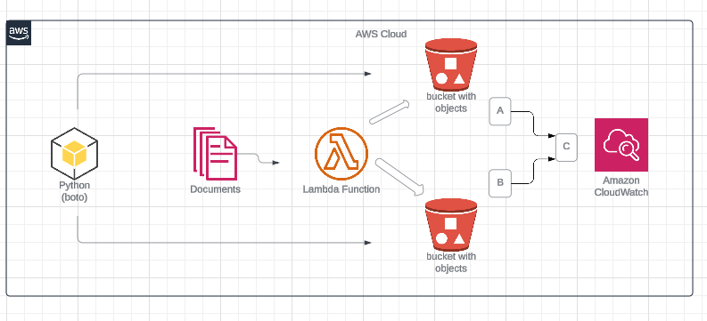

# AWS Billing Processing with S3 and Lambda




This project automates billing processing on AWS using S3 buckets and a Lambda function. It offers a streamlined workflow for:

- Creating S3 buckets to store reports (CSV files) generated during billing processing.
- Triggering a Lambda function upon new report upload to S3.
- Employing the Lambda function to process the uploaded CSV files and handle errors.
- Copying any error files detected by the Lambda function to a designated error bucket.
- Logging processing information and errors via CloudWatch.

## Requirements

- AWS Account with appropriate permissions
- Python 3.x
- boto3 library (`pip install boto3`)

## Setup

1. **Clone the repository:**

   ```bash
   git clone git clone https://github.com/Gaiatuven/aws-billing-processing.git

    Install boto3 library:

    bash

    pip install boto3

2   **Configure AWS credentials:**

    Create an IAM user with programmatic access and download the credentials as a JSON file.
    Set environment variables for AWS_ACCESS_KEY_ID and AWS_SECRET_ACCESS_KEY or configure them in your preferred method (e.g., AWS SDK configuration).

    Customize buckets (optional):

Modify the script (lambda_handler.py) to configure the bucket names for reports and errors according to your needs. You can use boto3 to create S3 buckets programmatically if desired.

#### Notes

This project utilizes boto3 to create S3 buckets and process CSV files uploaded to them. The Lambda function is responsible for processing the uploaded CSV files and handling any errors detected. If errors are picked up, they are copied into an error bucket for further analysis or processing.

Additionally, the project integrates with CloudWatch to log processing information and errors for monitoring and troubleshooting purposes.

Ensure that your Lambda function has appropriate IAM permissions to access S3 buckets, and CloudWatch logs for reading reports, writing error files, and logging processing information.

## License

This project is licensed under the [MIT License](LICENSE).
